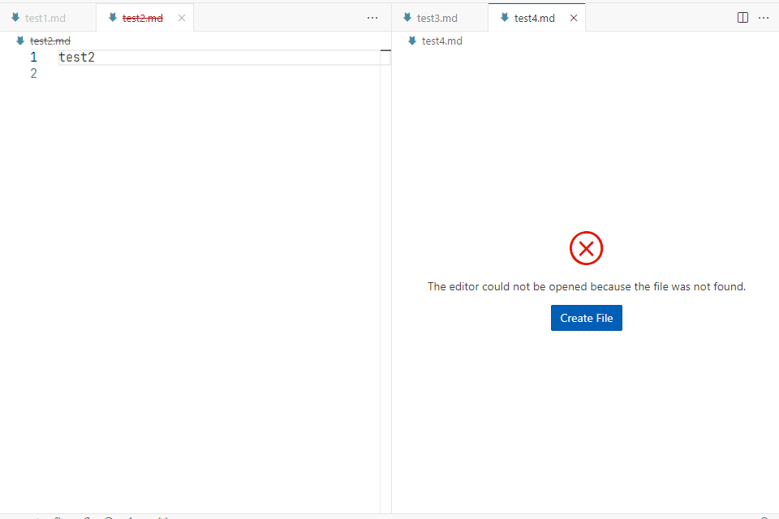

# vscode-more-file-command README
vscode extension "vscode-more-file-command" add file-related commands to the command palette
so you can rename, move or create a file easily.

## Features
### Rename the Current File

Rename the current file inside the command palette.
- If a file with the same name exists, the command will fail.

### Move the Current File

Move the current file to a different folder inside the command palette.
- You can move the current file inside the workspace folder.
- If a file with the same name exists, the command will fail.

### Delete the Current File

Delete the current file **permanently** inside the command palette.
- The extension will ask you again to make sure you are okay with deleting the file.

### Create New File

Create a new file at the selected folder.
- You can select a folder inside the workspace folder.
- Once you have selected a folder, the command will execute vscode built-in `File: New File` command inside the folder.

### Close All Removed Editors

Close all editors that show files that have been removed.
- Useful when you have lots of files that are being created or removed; e.g. git checkout.
- It will not close editors that are either modified or pinned.

<!-- ## Requirements -->

<!-- ## Extension Settings -->

<!-- ## Known Issues -->

## Release Notes
### v0.0.2
- Add new command: 'More File Command: Delete Current File'.
- Fix some commands not work on Windows platform.

### v0.0.1
- First release of the extension.

## Contributing
- [Open an issue](https://github.com/dlguswo333/vscode-more-file-command/issues) if there is any problem.
- [Create a pull request](https://github.com/dlguswo333/vscode-more-file-command/pulls) if you want to improve the code.

## Developments
This repository uses npm as package manager.
originally used pnpm but vsce does not support offcially as of early 2024, thus we switched to npm.
Check out the link for more: https://github.com/microsoft/vscode-vsce/issues/421
